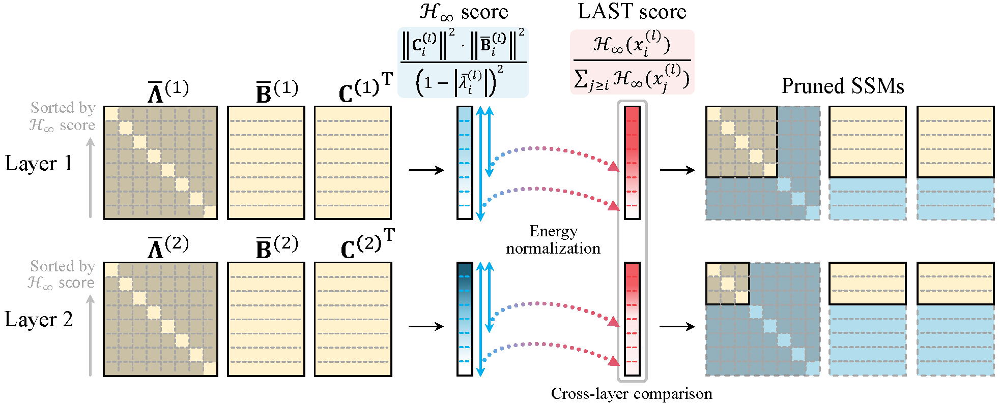

# LAST: Layer-Adaptive State Pruning

This repository provides the application of the method in the paper:
> **Layer-Adaptive State Pruning for Deep State Space Models**\
> Minseon Gwak, Seongrok Moon, Joohwan Ko, PooGyeon Park\
> Conference on Neural Information Processing Systems, 2024.\
> [arXiv](https://arxiv.org/abs/2411.02824)

to [S5](https://arxiv.org/abs/2208.04933) models.

## About
- State space models (SSMs), which are explainable models that parameterize dynamics, require **frequency-domain pruning criteria** due to differences in their transfer functions compared to ordinary neural networks.
- LAST identifies insignificant states in trained SSMs using the **$\mathcal{H}_{\infty}$ system norm** and prunes all parameters associated with the insignificant states.


## Dataset Preperation and Experiment

This repository contains example for LRA dataset, which can be downloaded by runing `.bin/download_lra.sh`.

To train and prune models, run:
- `.bin/run_experiments/run_lra_listops.sh`
- `.bin/run_experiments/run_lra_imdb.sh`
- `.bin/run_experiments/run_lra_aan.sh`
- `.bin/run_experiments/run_lra_cifar.sh`
- `.bin/run_experiments/run_lra_pathfinder.sh`
- `.bin/run_experiments/run_lra_pathx.sh`

## Usage
The LAST score for each SSM layer is computed using the code provided in [./s5/ssm.py](s5/ssm.py).
```python
class S5SSM(nn.Module):
    def setup(self):
        if self.pruning:
            if self.bidirectional:
                Hinfscore = (np.linalg.norm(self.C_tilde[:,:self.P], axis=0)+np.linalg.norm(self.C_tilde[:,-self.P:], axis=0))/2 **2 * np.linalg.norm(self.B_bar, axis=1)**2 / ((1-np.abs(self.Lambda_bar))**2 + 1e-8)
            else:
                Hinfscore = np.linalg.norm(self.C_tilde, axis=0)**2 * np.linalg.norm(self.B_bar, axis=1)**2 / ((1-np.abs(self.Lambda_bar))**2 + 1e-8)
            order = np.argsort(Hinfscore)
            LASTscore = np.sort(Hinfscore) / np.cumsum(np.sort(Hinfscore)[::-1])[::-1]
            self.LASTscore = Hinfscore.at[order].set(LASTscore)
```
Global state pruning, which takes into account the LAST scores of other layers, is performed using the code below.
```python
class S5SSM(nn.Module):
    def __call__(self, input_sequence, global_th):
        if self.pruning:
            mask = self.LASTscore >= global_th

            c_mask = np.tile(mask, 2) if self.bidirectional else mask
            ys = apply_ssm(mask * self.Lambda_bar,
                        mask.reshape(-1, 1) * self.B_bar,
                        c_mask.reshape(1, -1) * self.C_tilde,
                        input_sequence,
                        self.conj_sym,
                        self.bidirectional)
```


## Acknowledgement
We thank the contributors of [S5](https://github.com/lindermanlab/S5) repository for their splendid JAX implementation and scripts.


## Citation
Please use the following when citing our work.
```
@inproceedings{
  gwak2024layer,
  title={Layer-Adaptive State Pruning for Deep State Space Models},
  author={Gwak, Minseon and Moon, Seongrok and Ko, Joohwan and Park, PooGyeon},
  booktitle={The Thirty-eighth Annual Conference on Neural Information Processing Systems},
  year={2024}
}
```
